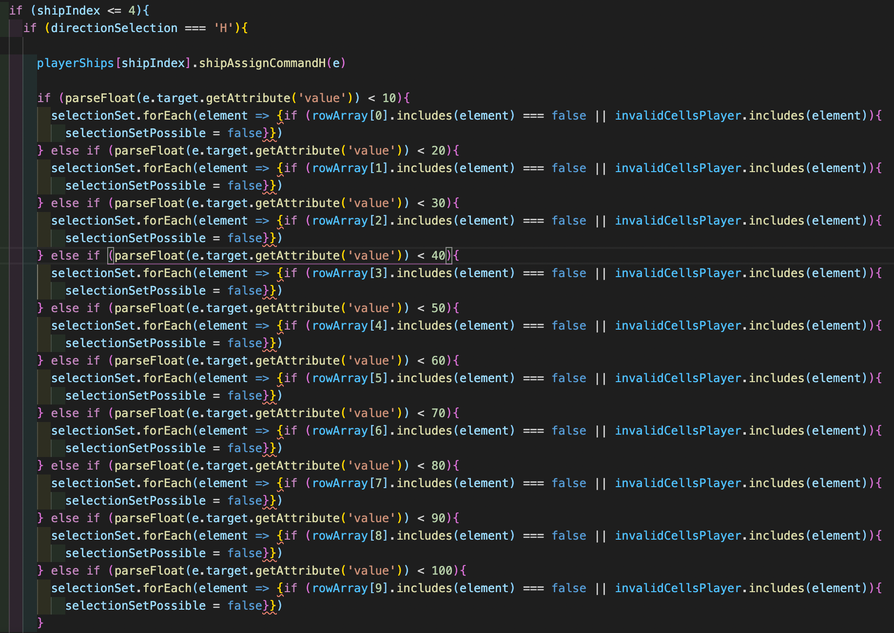

# sei57-webgame
Project One - Read Me

Overview:  

This is a JavaScript version of the popular classic game Battleships. It uses JavaScript, CSS and HTML to create a two player game with player two being a computer controlled logic system.

Getting Started:

To Try the game, fork the repository and type ‘npm run dev’ in the project terminal. The game will load within the browser in localhost 3000.

Try the game here: [https://felix-fe.github.io/sei57-webgame/](https://felix-fe.github.io/sei57-webgame/) 

Goal/ TimeFrame:

Brief:

The goal was to replicate the classic two player game, BattleShips. The game works on the basis that each player positions their battleships (of varying sizes) out of the view of their opponent, on a 10 by 10 grid. Each player takes their turn to guess the position of the other players' battleships. If a ship is hit the player exclaims “hit” until a whole ship has been sunk where the player will say “you sunk my battleship”. The game continues until all of one player's battleships are sunk. 

For my version I employed the use of JavaScript logic to create a ‘virtual’ player that would make guesses based on the rules above. For example, the virtual player must know when they have sunk a battleship and move onto the next one. They also had to be able to react to a hit ship and attempt to locate the rest of the ship. 

Technologies Used:

Node.js

JavaScript

HTML

CSS

Process:

To plan BattleShips, first I laid out the structure of the game so that I could design the functionality based on the rules of the game and its turn-based nature. Following this I made sure that I could incorporate a set of decisions that the computer could use in a similar style to the player. This would make it easier to identify any bugs or unforeseen results in the gameplay.

The Base of the game is two grids split into 10 by 10 squares. There are then the ship entities that occupy varying amounts of grid squares. There are also hit or miss squares which are sorted into two groups, missed by computer and missed by the player. The hit squares are sorted into the hits of individual ships, this is done so that the game can declare whether a certain ship has been hit and sunk.

Dom Events:

To be able to use the grid as a playable entity, the function that creates the grid also assigns event listeners to each square. Each square contains a number value which will be used by the event handler to decide whether the square is a valid place to lay a ship and whether it is a hit or miss.

Checking for hits/ computer decision: 

This logic is used to define the selection validity when assigning ships to their squares. Rows and columns are split to make it easier to define whether the length of the ship ‘overhangs’ the edge of the grid. It also checks whether the squares being placed are already occupied by a ship. The number of ships variable starts at the maximum, then when each ship is placed the variable is reduced by one until there are no more ships to place.

The computer goes through the same process except the selection of the position is decided by the random number generator function, which instead refers to the invalid computer squares and the row/column limits.

Making Guesses:

When the computer makes a guess it populates an array of the surrounding squares if a hit is made. On its next go it will refer to a snippet as shown above, one by one making its way through the array of possible next squares. When the next hit is made a direction variable is assigned and the computer will follow the given path with a similar snippet as above. The code will check if the square overhangs the grid or if it has already been chosen. It will carry on this pattern until the process has been completed.

Upon completion of the turn it is then turned over to the user where they place their guess. The logic assessed the arrays to see whether it is a possible position. If it is, the logic will check to see whether it is a hit. If it is a hit, the square is turned a deep red by a DOM selection combined with a class change. A whole ship is sunk by checking whether the hit counter for a particular ship is 0. The relevant class is then changed in the ship inventory below to indicate it has been sunk. This will also trigger a sound clip.

KnownErrors/Bugs:

Bug:

When placing the ships, if the user clicks twice the computer will move onto the next ship even though the game will only acknowledge the first ship placed. This will result in the computer not being able to win as there will technically be a ship that doesn't exist and therefore cannot be sunk.

Possible Fix:

Logic can be added that will refuse the click event if the block is already chosen. It would also help the user visually if there was a brief color change or a noise to indicate the ship has been placed.

Bug:

Due to the length of the largest ship, which is a 4 block entity, the computer choice algorithm will not be able to sink the ship if it picks a block which is either the second or third block. As the computer follows a certain direction after it locates the next block in the chain, if one of the previously mentioned blocks is picked, it will fail to pick the single block that was in the opposite direction.

Possible Fix:

Add logic to the game so that if it finished a chain and the ship it was attempting to sink is still not destroyed, the computer should try the block opposite to where it started.

Bug:

Upon the first rendering of the game the computer ship choice sometimes ‘forgets’ to lay one of the ships. This can be fixed by simply reloading the page, although this is not ideal.

Possible Fix:

After the computer has laid the ships it should check to see whether all the ships have been deployed. If any of the ships have not been deployed it is to run the ship laying algorithm again for the ship or ships it has missed.

Challenges:

The main challenge was being able to instruct the computer on picking places to locate their ships along with the picking decision logic. Starting with the basic logic of finding a pattern to follow in regards to picking the next square after an initial hit, many conditions had to be set as to the limits of its choices. And if the choices were limited, it used the next given available option.

Wins:

* Deeper applied use of the various methods and variable types available within JavaScript to aid in the variable choices.
* Developing a mindset that understands the workings of JavaScript to identify where possible bugs or errors may be occurring.

Future Improvements:

1. Adding in a possible second player option so that the user can play with their friends.
2. Adding in improved ship icons to improve the aesthetics of the game.
3. Simplifying the computer logic so that each next move is triggered by individual functions to create a reliable and repeatable picking process.
4. Difficulty options so that the user can specify their expertise of the game so the computer is more evenly matched with the user.

Key Learnings:

The process of building my first JS application helped me develop my understanding of the designing and implementation of key features and gameplay through the use of DOM events and JavaScript logic. Through heavy use of if statements and key variables I was able to develop a robust system that responded to key events in the gameplay.